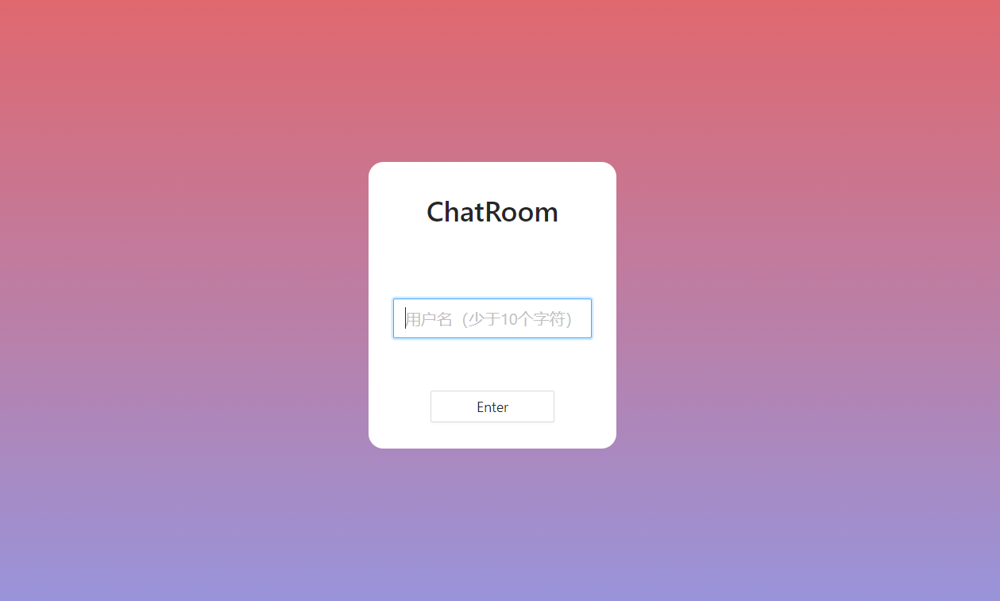
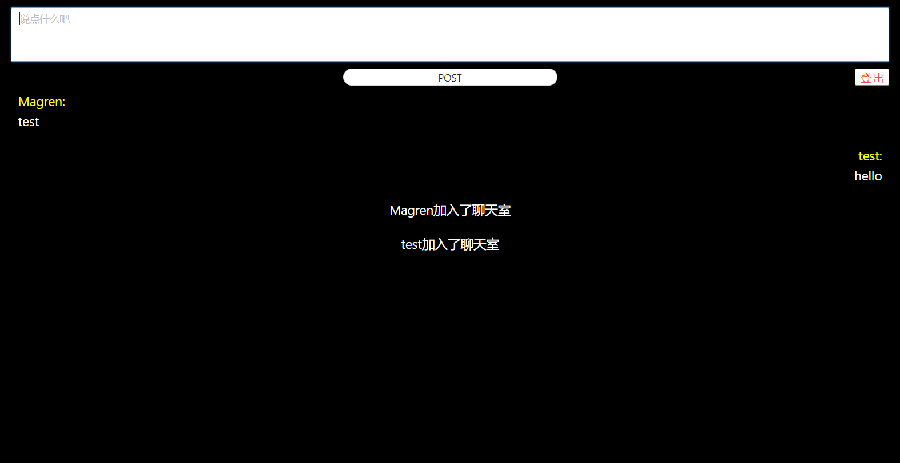

# 💻 ChatRoom
👋 这是我个人在学习react过程中做的一个练习用项目。
一个聊天室💬，可以登录、创建房间、加入房间以及聊天。

前端基于React + Redux + Typescript + Antd,
后端基于node.js + express + socket.io

# 🔨 Usage
前端：
> cd ChatRoom/chatroom

> npm install

> npm start
后端：
> cd ChatRoom/chatroomServe

> npm install 

> npm start

# 🔍 Screenshot

